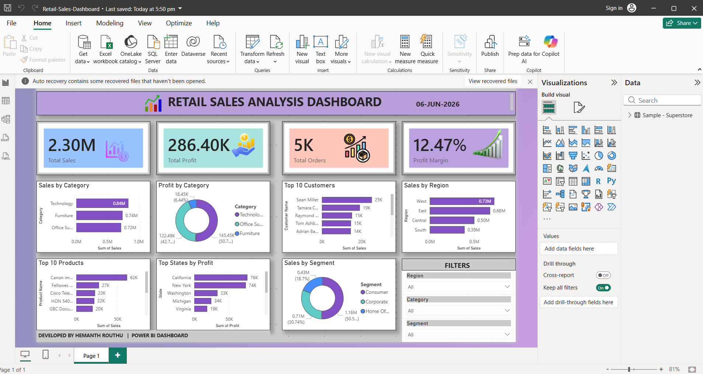

# Retail-Sales-Analysis-Dashboard

## Project Overview
Built an interactive Retail Sales Analysis Dashboard using Power BI and SQL.

## Business Questions
- Which categories generate maximum revenue?
- Which products generate maximum profit?
- Which customers contribute most to sales?
- Which regions and states perform best?
- Which products cause losses?
- How discounts affect profitability?

## Tools Used
- Power BI
- SQL
- CSV Dataset

## Dashboard Features
- KPI Cards
- Dynamic Filters
- Sales Analysis
- Profit Analysis
- Customer Analysis
- Region Analysis

## Key Insights
- Technology generates highest sales.
- West region drives maximum revenue.
- California contributes highest profit.
- Furniture category has lower profit margins.

## Dashboard Preview

## Author
Hemanth Routh
